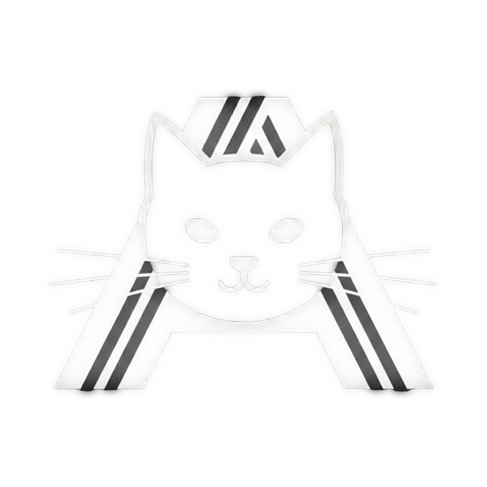

#  Astral Team

**Astral Team** — веб-сайт магазина компьютерных игр, разрабатываемый как полноценная игровая платформа с каталогом игр, пользовательскими аккаунтами и дополнительными сервисами.

## 🎮 О проекте

Astral Team создаётся с целью объединить привычный магазин компьютерных игр с современным и удобным пользовательским интерфейсом.

Основные направления проекта:

* 🎮 Каталог компьютерных игр
* 🔎 Поиск и просмотр игр
* 👤 Регистрация и авторизация пользователей
* 🛒 Работа с игровой библиотекой
* 🏆 Пользовательские рейтинги и статистика
* 🗺️ Дополнительные игровые разделы
* 🔐 Безопасная работа с пользовательскими данными
* ⚡ Быстрое взаимодействие между frontend и backend

Проект разрабатывается с нуля, включая клиентскую и серверную части.

## 🧩 Архитектура

Astral Team разделён на несколько основных частей:

```text
Astral Team
├── Frontend/       # Клиентская часть
└── Backend/        # Серверная часть
```

### Frontend

Клиентская часть отвечает за интерфейс сайта и взаимодействие пользователя с приложением.

Используемые технологии:

* **React** — построение пользовательского интерфейса
* **TypeScript** — типизация JavaScript-кода
* **Vite** — сборка и разработка проекта
* **SCSS / CSS** — стилизация интерфейса

### Backend

Серверная часть отвечает за API, авторизацию, работу с пользователями и данными приложения.

Используемые технологии:

* **Python**
* **FastAPI**
* **MySQL**
* **Redis**

## 🔐 Авторизация

В проекте реализуется собственная система пользователей с поддержкой:

* регистрации;
* авторизации;
* пользовательских сессий;
* хранения профиля;
* защищённого взаимодействия с API.

Frontend и backend взаимодействуют через HTTP API.

## 🎨 Интерфейс

Основное внимание уделяется:

* минималистичному дизайну;
* плавным анимациям;
* адаптивности;
* удобной навигации;
* визуальной целостности всех страниц.

Интерфейс создаётся самостоятельно без использования готового шаблона магазина.